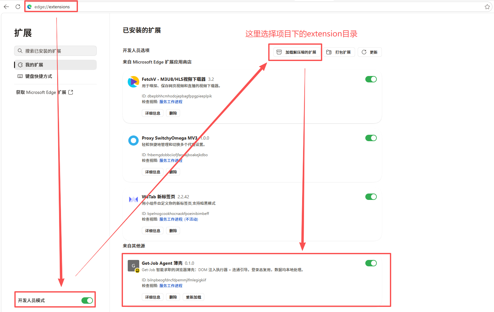

# Get-Job Agent · 智能求职 Agent

> 把「找工作时一遍遍刷岗位」这件事，交给一个 **24 小时在线的浏览器 Agent**。

求职最累的不是面试，而是要在海量 JD 里反复翻页、逐条比对、「会不会错过适合我的岗位」的焦虑。Get-Job Agent 的初衷很简单：**帮你自动化地分析岗位、精准投递、随时在线，不错过一个真正适合你的机会**。

它是一套 **本地 Agent Server + Chrome 浏览器薄壳** 的双端系统：Server 是唯一「大脑」，负责理解目标、筛选比对、生成话术并编排流程；浏览器扩展是唯一「手」，负责在真实招聘页面上落地操作，并复用你已登录的账号态。

> ⚠️ 本项目聚焦 **毕业季求职 / 投递自动化**场景，请在使用前充分了解并遵守目标平台（如 BOSS 直聘）的服务条款与风控规则，理性控制投递频率，勿滥用。

---

## ✨ 功能特性

- **自然语言下达目标**：在侧边栏用一句话描述你的求职目标 / 岗位偏好，Agent 自动规划并执行。
- **搜岗 → 读 JD → 简历比对 → 沟通 → 打招呼发送** 全流程闭环，逐岗位跑完，不只是一份筛选清单。
- **简历画像**：支持 PDF / DOCX 附件与在线简历两种来源，自动解析 → 抽取 → 校验 → 入库，作为岗位匹配的「单一事实源」。
- **逐模块岗位匹配**：技能 / 经验 / 学历 / 薪资 / 城市加权打分，达标才进入沟通环节（阈值与权重可在 `config/config.yaml` 调整）。
- **过目清单（跨重启持久）**：以「公司|岗位」为键去重，已处理 / 已打招呼的岗位不会重复打扰。
- **无人值守（unattended）与人工确认（confirm）双模式**：无人值守可一直跑到无更多达标岗位 / 触顶；人工确认模式每次发送话术前暂停，等你批准 / 修改 / 拒绝。
- **原生 Human-in-the-Loop**：话术发送走 LangChain 官方 HITL（approve / edit / reject），不手搓。
- **持久化会话**：LangGraph Postgres checkpoint，跨轮对话、断点续跑、崩溃可恢复。
- **自适应长期记忆**：Agent 边干边学，把可复用的页面操作经验写进 `/memories/lessons.md` 自更新，避免重复踩坑。
- **过程实时可见**：侧边栏流式展示「正在运行 / 工具调用 / 结果摘要」，随时停止、清空会话。
- **护栏与风控**：投递上限、单段模型 / 工具调用限额、软错误退避重试、上下文自动压缩，多道防线防失控。

---

## 🧭 架构总览

```
┌───────────────────────────── Chrome 扩展（薄壳，MV3）────────────────────────────┐
│   Side Panel（控制面板）        Service Worker             Content Script          │
│   · 下目标 / 看流式过程           · 扩展内消息路由             · 唯一 DOM 执行器        │
│   · HITL 批准/修改/拒绝话术       · /health 探活              · 复用页面登录态        │
│          │   WS(panel)               │ chrome.runtime            │  WS(page)        │
└──────────┼───────────────────────────┼───────────────────────────┼───────────────────┘
           │                            └───────────────────────────┤
           │                       ws://127.0.0.1:8791/ws           │
           ▼                                                         ▼
┌────────────────── FastAPI Local Agent Server（唯一枢纽 + 唯一大脑）────────────────┐
│  api/  ── routes/ws.py   _WsHub 两路长连接注册表 + 定向中继 + PageActionBridge       │
│       └─ routes/agent.py（REST 简历）  routes/health.py（连通自检）                  │
│  agent/ ─ harness.py create_deep_agent（单例编译图，按 thread_id 隔离状态）           │
│       ├─ tools/    browser_snapshot·browser_act·start_chat·send_greeting            │
│       │            get_resume_summary·compare_job_with_resume                       │
│       │            get_reviewed_jobs·review_job                                     │
│       ├─ state.py  JobAgentState（护栏计数入 checkpoint）                            │
│       ├─ observability.py  RunTraceMiddleware（运行观测）                            │
│       ├─ tool_retry.py     BrowserToolRetryMiddleware（软错误退避重试）               │
│       └─ job_ledger.py     过目清单（数据/job_ledger.json，跨重启）                   │
│  infra/ ─ checkpoint.py（Postgres AsyncPostgresSaver）  postgres.py  resume_store.py │
│  core/  ─ config.py（.env + config.yaml）  logs.py（loguru）                         │
└───────┬──────────────┬───────────────┐
        ▼              ▼               ▼
    对话 LLM       Postgres        Postgres
  DeepSeek/    boss_agent       get_job_agent_ckpt
  LM Studio   (resumes 表)       (checkpoint)
 (OpenAI 兼容)
```

**职责边界**

| 端 | 职责 | 绝不做的事 |
| --- | --- | --- |
| Side Panel | 人机界面：下目标、看流式过程、HITL 确认 | 不碰 DOM、不做决策 |
| Service Worker | 扩展内消息路由 + 状态缓存 | 不持有常驻 WS（MV3 休眠） |
| Content Script | **唯一** DOM 读写执行器，复用登录态 | 不做业务决策、不直连 LLM |
| FastAPI Server | WS 中枢、Agent 编排、持久化、护栏 | 不直接操作浏览器（一律经 CS） |

> 技术栈：Python 3.11+ · FastAPI · LangChain / LangGraph / DeepAgents · LangSmith（可选）· PostgreSQL(psycopg3 + asyncpg) · Chrome MV3 扩展
>
> 详细架构走读、数据流向与对照官方文档的逐项映射见 [docs/架构全景与官方文档对照.md](docs/架构全景与官方文档对照.md)；
> 该实现对照 DeepAgents 官方标准的设计评估见 [docs/DeepAgents官方标准设计评估.md](docs/DeepAgents官方标准设计评估.md)。

---

## 🚀 快速开始

### 0. 前置要求

- Python **3.11+**
- **PostgreSQL**（业务库与 checkpoint 库，Server 启动时会自动建表 / 建库）
- Chrome 浏览器（用于安装扩展）
- 一个可用的 OpenAI 兼容 LLM 端点：**DeepSeek 官方 API**，或**本地 LM Studio**（无需 Key）

### 1. 安装依赖并配置

```bash
# 克隆仓库后
python -m venv .venv
# Windows
.venv\Scripts\activate
# macOS / Linux
source .venv/bin/activate

pip install -r requirements.txt
# 或安装为包（含 dev 依赖）：pip install -e ".[dev]"
```

复制环境变量模板并填写：

```bash
cp .env.example .env
```

关键配置（详见 `.env.example` 与 `src/get_job_agent/core/config.py`）：

| 变量 | 说明 |
| --- | --- |
| `LLM_PROVIDER` | `deepseek`（官方 API，需 Key）或 `lmstudio`（本地，无 Key） |
| `DEEPSEEK_API_KEY` | DeepSeek 官方 API Key，`LLM_PROVIDER=deepseek` 时必填 |
| `LMSTUDIO_BASE_URL` / `LMSTUDIO_MODEL` | 本地开源模型端点（OpenAI 兼容） |
| `POSTGRES_*` | PostgreSQL 连接信息；业务库 `POSTGRES_DB` 需先创建，checkpoint 库自动创建 |
| `AGENT_MODE` | `unattended`（无人值守自动发送）或 `confirm`（发送前人工确认） |
| `MAX_GREETINGS_PER_RUN` | 单轮自动打招呼安全上限（`0` = 不限） |

简历放置：把简历（PDF / DOCX）放进项目根目录 `jianli/`，Server 启动时自动解析入库。

### 2. 启动本地 Agent Server

```bash
python main.py                  # 默认 127.0.0.1:8791，带热重载
# 或
python main.py --host 0.0.0.0 --port 8791
```

### 3. 安装浏览器扩展（Chrome 加载已解压的扩展程序）

安装示意如下：



1. 打开 Chrome，访问 `chrome://extensions/`
2. 右上角打开「开发者模式」
3. 点击「加载已解压的扩展程序」，选择本项目的 `extension/` 目录
4. 在扩展栏固定「Get-Job Agent 薄壳」，点击打开侧边栏

### 4. 开始使用

1. 登录招聘平台（扩展会复用你的登录态）
2. 打开侧边栏，确认「Agent Server」与「当前 Get-Job 页」均显示**已连接**
3. 在「目标」输入框用自然语言描述你的求职目标，点击「执行」
4. 观察流式运行过程；`confirm` 模式下话术发送前会暂停等待你批准 / 修改 / 拒绝

**功能演示视频：**


> 若视频无法在预览中播放，可点击查看：[docs/功能演示.mp4](docs/功能演示.mp4)

---

## 🎛️ 配置说明

- **凭证 / 连接串**：`.env`（不入库）
- **业务规则 / 阈值 / 页面选择器**：`config/config.yaml`

`config/config.yaml` 支持按需调整：

```yaml
filters:
  city: []            # 城市/地区
  experience: []      # 经验要求
  education: []       # 学历要求
  salary: []          # 薪资范围
  distance_km: 30     # 通勤距离上限

matching:
  threshold: 0.6      # 进入沟通环节的最低匹配分
  weights:            # 面板筛选各维度权重（和为 1）
    experience: 0.30
    education: 0.20
    salary: 0.30
    city: 0.20
```

页面选择器 `selectors.*` 对应招聘平台真实 DOM，如平台改版可能需要重新校准。

---

## 📁 目录结构

```
├── main.py                     # 本地启动入口（跨平台，等价 scripts/dev.sh）
├── pyproject.toml              # 打包 / 依赖 / ruff / pytest 配置
├── requirements.txt            # 依赖清单
├── config/
│   └── config.yaml             # 业务规则 / 匹配阈值 / 页面选择器
├── src/get_job_agent/          # Agent Server 源码
│   ├── main.py                 # FastAPI 应用入口（lifespan 初始化）
│   ├── agent/                  # DeepAgent 编排 / 工具 / 状态 / 观测 / 护栏
│   ├── api/                    # REST 简历 + WS 中继 + 健康检查
│   ├── core/                   # 配置与日志
│   ├── infra/                  # Postgres / checkpoint / 简历存储
│   ├── jobs/                   # 启动期简历扫描
│   └── schemas/                # Pydantic 模型
├── extension/                  # Chrome MV3 薄壳（background/content/sidepanel）
├── agent_resources/            # Agent 长期记忆（AGENTS.md 等）与 skills
├── scripts/                    # dev.sh / init_m1.py
├── docs/                       # 架构文档、设计评估、演示视频、安装图
└── tests/                      # pytest 测试
```

---

## 🧪 测试

```bash
pip install -e ".[dev]"
pytest
```

测试覆盖：健康检查、岗位过滤打分、简历构建流程等（其余运行期逻辑依赖真实浏览器与平台页面，未纳入单元测试）。

---

## 🛠️ 技术要点

在内部实现上，我们对齐了 LangChain / DeepAgents 官方范式（详见 [docs/DeepAgents官方标准设计评估.md](docs/DeepAgents官方标准设计评估.md)）：

- 原生 **Human-in-the-Loop**：`interrupt_on={send_greeting:...}` + `Command(resume=...)` 同线程恢复，decision 支持 `approve/edit/reject`。
- 自更新记忆 + 写权限锁：Agent 只能写 `/memories/**`，防改坏 SOP。
- 官方限额中间件（`ModelCallLimitMiddleware` / `ToolCallLimitMiddleware`）成对封顶失控循环。
- Postgres `AsyncPostgresSaver` 持久 checkpoint，崩溃续跑 / HITL 暂停点跨重启精确恢复。
- `CompositeBackend` 组合：内存态承载会话转录与工具大结果，不污染仓库。
- `RunTraceMiddleware` + 可选 LangSmith，全链路可评估、可回放。

---

## 📜 License

[MIT](LICENSE) License © 2026 Get-Job Agent Contributors

---

## ⚠️ 免责声明

该项目仅用于学习与技术交流。自动化求职操作涉及第三方平台，请：

- 遵守目标平台的服务条款、反爬与风控规则；
- 使用高频投递可能对账号产生风险，请合理设置 `MAX_GREETINGS_PER_RUN`；
- 因擅自修改工具、降低风控门槛或用于违规用途导致的封号、法律风险由使用者自行承担。

如果你觉得这个项目有帮助，欢迎 ⭐ Star 与提交 Issue / PR。